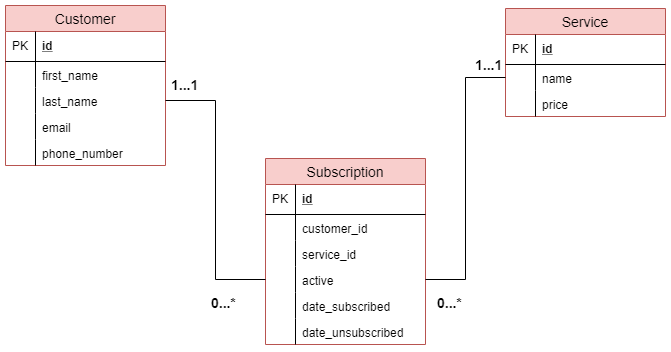

# Customer Subscription Application
This application was built using ubuntu 18.0.4 Operating System.

# How to run this application
## Flask Application.
Install virtualenv on your machine.

```bash
pip install virtualenv
```

create a virtual environment
```bash
virtualenv <environment_name>
```
Activate the virtual environment
```bash
source <environment_name>/bin/activate
```

Install all requirements provided in the requirements.txt
```bash
pip install -r requirements.txt
```

Run the flask server
```bash
python app.py
```

## Angular Application: Angular 8.0

Ensure that node.js and node package manager (npm) are installed.

Install the Angular CLI
```bash
npm install -g @angular/cli
```

Install all necassary packages.
Navigate to the Angular project directory and run the following command
```bash
npm install 
```

Run the project
```bash
ng serve
```

## Database Design
